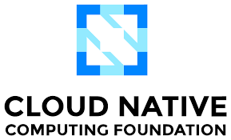
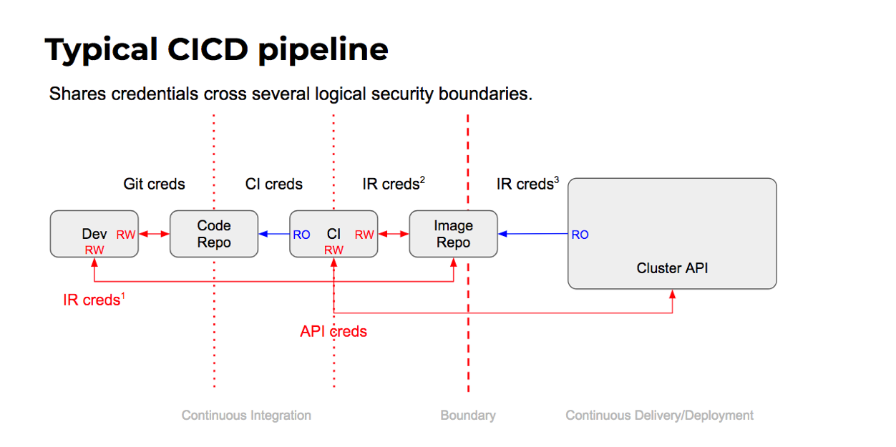
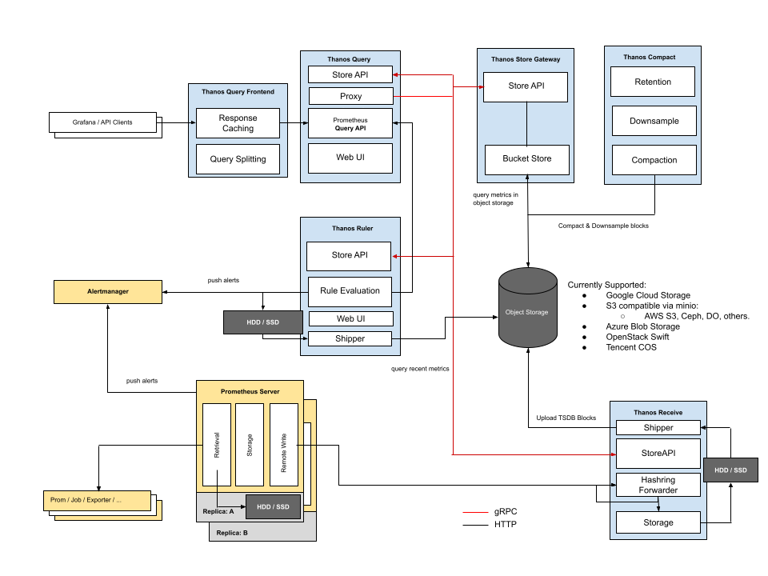

+++
title = "Cloud Native"
lastmod = '2022-12-05'
+++

By leveraging the power of the cloud, our engineering solutions can help your
business to achieve faster time-to-market, increased productivity, and improved
collaboration.

<!--more-->

## Kubernetes

Kubernetes is a powerful and complex system for container orchestration, but it
can also be difficult to navigate and manage. That's where we can help you.
Our team of experts has a deep understanding of Kubernetes and can help your
organization leverage its full potential.
Whether you're just getting started with Kubernetes or looking to optimize your
existing deployment, we can provide the guidance and support you need.
With our help, you can take on the complexities of Kubernetes with confidence
and achieve your desired outcomes.

So, don't let the complexities of Kubernetes hold you back – let us help you
succeed.

<!--
## CI/CD

-->

## Prometheus

If you’re looking to improve the observability of your cloud-native
applications, using the Prometheus ecosystem is the de-facto approach to
consider. However, setting up and maintaining a Prometheus monitoring stack can
be complex and time-consuming, especially when considering long-term storage
and durability.

## Observability stacks

We have extensive experience in building and optimizing Cloud Native
observability stacks (Prometheus/Thanos/Mimir, Loki, Grafana). We can also help
with training your DevOps teams for the effective use of these observability
platforms.

