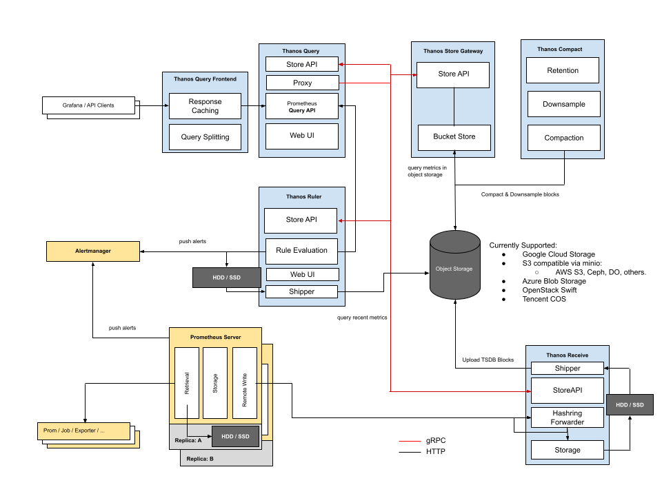

+++
title = "Cloud Native"
lastmod = '2022-12-05'
weight = 10
+++

By leveraging the power of the cloud, our engineering solutions can help your
business to achieve faster time-to-market, increased productivity, and improved
collaboration.

<!--more-->



## Kubernetes

[Kubernetes](https://kubernetes.io) is a powerful and complex system for
container orchestration, but it can also be difficult to navigate and manage.
That's where we can help you.  Our team of experts has a deep understanding of
Kubernetes and can help your organization leverage its full potential.
Whether you're just getting started with Kubernetes or looking to optimize your
existing deployment, we can provide the guidance and support you need.
With our help, you can take on the complexities of Kubernetes with confidence
and achieve your desired outcomes.

Read our [FAQ entry about Kubernetes](/home/services/faq/#kubernetes).

So, don't let the complexities of Kubernetes hold you back –
[let us help you succeed](/contact).

## Prometheus

If you’re looking to improve the observability of your cloud-native
applications, using the [Prometheus](https://prometheus.io) ecosystem is the
de-facto approach to consider. However, setting up and maintaining a Prometheus
monitoring stack can be complex and time-consuming, especially when considering
long-term storage and durability.

## Observability stacks

We have extensive experience in building and optimizing Cloud Native
observability stacks
([Prometheus](https://prometheus.io)/[Thanos](https://thanos.io)/[Mimir](https://grafana.com/oss/mimir/),
[Loki](https://grafana.com/oss/loki/), [Grafana](https://grafana.com/oss/grafana/)).
We can also help with training your [DevOps](/home/services/devops)
teams for the effective use of these observability platforms.

Cloud native observability stacks provide organizations with the tools and
technologies needed to effectively monitor and observe the behavior of cloud
native systems in real-time. These stacks typically include a combination of
logging, tracing, and metric collection tools, which can be used to collect and
analyze large amounts of data about system behavior. By using cloud native
observability stacks, organizations can gain a more complete and accurate view
of how their systems are functioning, which is critical for ensuring reliable
and performant operation in complex, distributed environments.

In addition to providing visibility and understanding of system behavior, cloud
native observability stacks can also help organizations to identify and
troubleshoot issues, optimize system performance, and make more informed
decisions about how to improve their systems over time. By embracing cloud
native observability stacks, organizations can gain the insights and
understanding they need to operate and manage their cloud native systems more
effectively and efficiently.

Read our [FAQ entry about Cloud Native Observability](/home/services/faq/#cloud-native-observability).

[We are happy to help you build your observability stack](/contact).

