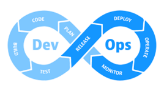

+++
title = "DevOps"
lastmod = '2022-12-04'
weight = 20
+++

Innovating technology, optimizing processes, and enhancing collaboration with
devops engineering.

<!--more-->



## DevOps

DevOps practices have become increasingly important for organizations looking
to improve the speed and efficiency of their software development and delivery.
However, implementing these practices can be a challenge, especially for
organizations that are new to DevOps.

We offer comprehensive training and implementation services to help your
organization adopt and effectively utilize DevOps practices. Our team of
experts has a wealth of experience with a variety of DevOps tools and
methodologies, and we can help you design and implement a customized solution
that meets your specific needs and goals. With our help, you can improve your
team's collaboration, automation, and continuous delivery capabilities and
achieve better outcomes for your business.

Read our [FAQ entry about DevOps](/home/services/faq/#devops).

[Contact us for more details](/contact).

## CI/CD

Continuous integration and delivery (CI/CD) is a critical practice for modern
software development organizations. It allows teams to rapidly and reliably
deliver code changes and new features to users.
However, implementing and maintaining a CI/CD pipeline can be complex and
challenging, especially for organizations new to these practices.
Our team of experts has a wealth of experience with CI/CD and can
help your organization set up and optimize a pipeline that meets your specific
needs and goals.
We can assist with everything from infrastructure and tool selection to
pipeline design and integration with your existing workflow.
