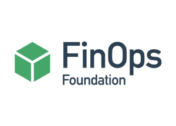

+++
title = "FinOps"
lastmod = '2022-12-04'
weight = 30
+++

Trouble with your cloud bill?
We are here to help.

<!--more-->

Managing cloud costs can be a significant challenge for organizations,
especially as they scale and their usage patterns change.
[FinOps](https://www.finops.org) is a set of practices and tools that can help
organizations optimize their cloud costs and reduce waste. However,
implementing FinOps can be complex, and it requires a deep understanding of the
various pricing models and cost optimization strategies available.

We can assist with everything from cost modeling and budgeting to resource
optimization and cost allocation. With our help, you can take control of your
cloud costs and achieve better outcomes for your business. Don't let the
complexities of FinOps hold you back – let us help you succeed.

Read our [FAQ entry about FinOps](/home/services/faq/#finops).

[Let us help you implement your FinOps strategy](/contact).
